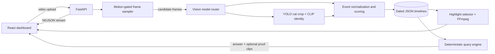

# PawPrints

PawPrints turns ordinary cat footage into a searchable activity diary. Upload a video and the application finds meaningful moments, identifies registered pets, builds a timestamped timeline, creates a short highlight reel, and answers questions such as "Did Milo play yesterday?" with optional video evidence.

The project combines a warm, playful React interface with a streaming Python pipeline. Analysis appears in the dashboard while it is still running, so users can inspect detected moments instead of waiting for the entire video to finish.

## What you can do

- Register up to two cats with one or more reference photos.
- Choose a local Ollama vision model or a hosted Gemini, Claude, or OpenAI model.
- Drag and drop a video for analysis.
- Watch progress, candidate frames, and the activity timeline update live.
- Open a recording and jump to any detected event by its timestamp.
- Generate a diverse, captioned highlight reel automatically.
- Ask natural-language questions across today, yesterday, an ISO date, or the last _N_ days.
- Request individual proof clips for the events behind an answer.

## Quick start

### 1. Prerequisites

- Python 3.11 or 3.12 (Python 3.12 is recommended)
- Node.js 20 LTS and npm
- Git
- One vision-model option:
  - **Local:** [Ollama](https://ollama.com/) plus a vision-capable model; no API key is required.
  - **Hosted:** a Gemini, Anthropic, or OpenAI API key.

FFmpeg is resolved automatically through `imageio-ffmpeg` when it is not already on `PATH`. The first analysis can also download OpenCLIP and YOLOv8n model weights, so allow extra time, internet access, and disk space on first use.

### 2. Install and configure the backend

From the repository root:

```powershell
cd src\backend
python -m venv .venv
.\.venv\Scripts\Activate.ps1
python -m pip install --upgrade pip
python -m pip install -r requirements.txt
Copy-Item .env.example .env
```

On macOS or Linux, activate the environment with `source .venv/bin/activate` and copy the file with `cp .env.example .env`.

### 3. Choose a vision model

API keys belong only in [`src/backend/.env`](src/backend/.env.example). Do not paste a key into the web interface and do not commit the `.env` file; it is already excluded by `.gitignore`.

#### Option A: local Ollama, no API key

Install Ollama, then run:

```powershell
ollama pull qwen2.5vl:3b
ollama serve
```

Use these values in `src/backend/.env`:

```dotenv
VISION_MODEL_PRIMARY=qwen
VISION_MODEL_FALLBACK=
OLLAMA_MODEL=qwen2.5vl:3b
```

`qwen` is the application's provider key for the Ollama route. The Settings screen will list the models actually installed in Ollama, so another vision-capable Ollama model can be selected without changing code.

#### Option B: Gemini

```dotenv
GEMINI_API_KEY=your_key_here
GEMINI_AUTH_MODE=api_key
VISION_MODEL_PRIMARY=gemini
VISION_MODEL_FALLBACK=qwen
```

Leave the fallback blank if Ollama is not installed. Vertex AI is also supported by setting `GEMINI_AUTH_MODE=vertex`, adding `GOOGLE_PROJECT_ID`, and authenticating locally with `gcloud auth application-default login`.

#### Option C: Anthropic or OpenAI

```dotenv
# Anthropic
ANTHROPIC_API_KEY=your_key_here
ANTHROPIC_MODEL=claude-sonnet-4-5
VISION_MODEL_PRIMARY=claude

# Or OpenAI
OPENAI_API_KEY=your_key_here
OPENAI_MODEL=gpt-4o
VISION_MODEL_PRIMARY=openai
```

Gemini and Ollama are the two adapters tested end to end in this repository. The Claude and OpenAI adapters use the same routing contract but should be validated with the model and account used for judging.

### 4. Start the backend

Run this from `src/backend` with the virtual environment active:

```powershell
python -m uvicorn app.api.server:app --reload --port 8000
```

Check [http://localhost:8000/api/health](http://localhost:8000/api/health). A healthy server returns:

```json
{"status":"ok"}
```

### 5. Start the frontend

Open a second terminal:

```powershell
cd src\frontend
npm ci
npm run dev
```

Open [http://localhost:5173](http://localhost:5173).

The frontend uses `http://localhost:8000` by default. To use a different API address, create `src/frontend/.env.local`:

```dotenv
VITE_API_BASE_URL=http://localhost:8000
```

## Electron shell

The Electron entry point can launch the backend and open the React UI in a native desktop window instead of a browser tab. `src/frontend/electron/main.js` starts the backend itself via the `py -3.12` launcher, waits for `/api/health` to report healthy, and only then opens the window - so there is no separate "start the backend" step for this path. It also shuts the backend down cleanly when the window closes.

Keep the Vite dev server running and launch Electron in another terminal:

```powershell
cd src\frontend
npm run dev
# In another terminal, from the same directory:
npm run electron
```

The browser workflow above remains the portable judging path. Packaging the Python runtime for a fully standalone desktop build is listed as a future improvement.

## First-use walkthrough

1. Open the cat-face **Settings** button.
2. Select a primary model and, optionally, a failover model. If Ollama is selected, choose one of the locally installed models. Click **Save**.
3. Optionally register one or two cats. Add several clear JPEG or PNG photos from different angles and lighting for stronger identity matching.
4. Click **Add Footage**, choose a video, and click **Analyze Footage**.
5. Open the new dashboard card to watch the source video, inspect the growing timeline, and jump to detected events.
6. When processing finishes, open the generated highlight reel if enough useful events were found.
7. Use the floating cat assistant, or the chat inside a footage view, to ask questions. Enable **Include evidence clip with the answer** when you want playable proof.

A sample-footage link is available in [`src/data/link.txt`](src/data/link.txt).

## How the pipeline works



The backend does not send every frame to an AI model. OpenCV samples the video every 0.5 seconds, detects motion on a downscaled frame, emits candidates at bounded intervals, and sends occasional stillness pings so long quiet activities such as sleeping are not lost. Candidate frames keep their aspect ratio and cap the long edge at 768 pixels before model analysis.

The vision-language model describes the scene but is not trusted to name the pet. Identity is handled separately: YOLOv8n finds and pads the cat region, OpenCLIP embeds the crop and the registered reference photos, and a threshold-plus-margin decision chooses a match. Model output is then cleaned, normalized, merged into events, scored, and saved to collision-safe daily timelines.

The query layer is deliberately deterministic. It parses dates and intent, expands activity and object synonyms, weights evidence from activity, summary, interaction, and object fields, and returns the exact timeline records behind the answer. Proof clips are generated only when requested.

## Technology stack

| Layer | Technology | Role |
|---|---|---|
| Desktop/web UI | React 18, Vite 5, CSS, Electron 31 | Dashboard, settings, uploads, timeline playback, query chat, and desktop shell |
| API | FastAPI, Uvicorn, Pydantic | Typed endpoints, multipart uploads, static media, and streamed NDJSON progress |
| Video analysis | OpenCV | Sampling, motion detection, frame resizing, and timestamps |
| Vision providers | Ollama, Google GenAI, Anthropic, OpenAI | Interchangeable scene-description adapters with primary/fallback routing |
| Pet identity | YOLOv8n, OpenCLIP, PyTorch, Pillow | Cat localization and visual-similarity matching against reference photos |
| Media output | FFmpeg through `imageio-ffmpeg` | Captioned highlight reels and normalized query-evidence clips |
| Storage | Local JSON, images, and MP4 files | Profiles, raw results, timelines, query archives, proofs, and highlights |
| Tests | Python `unittest` | Event, identity, storage, query, proof, and highlight behavior |

## API summary

| Method | Endpoint | Purpose |
|---|---|---|
| `GET` | `/api/health` | Backend health check |
| `GET` | `/api/models` | Supported model-provider keys |
| `GET` | `/api/ollama-models` | Models currently available from Ollama |
| `GET/POST` | `/api/pets` | List or register pet profiles |
| `POST` | `/api/pets/{id}/images` | Add a reference photo |
| `PATCH/DELETE` | `/api/pets/{id}` | Rename or remove a profile |
| `POST` | `/api/footage/analyze` | Upload footage and receive NDJSON progress events |
| `POST` | `/api/query` | Ask a dated activity question and optionally request proof |

## Generated data

PawPrints stores local run data in these ignored directories:

- `src/data/uploads/` - uploaded source videos
- `src/data/frames/` - motion/stillness candidate frames
- `src/data/events/` - low-level stream events
- `src/data/jsons/` - raw vision output and dated final timelines
- `src/data/pet_profiles/` - profile manifest and managed reference photos
- `src/results/highlight-reel/` - captioned reels and manifests
- `src/results/query-results/` - archived query responses
- `src/results/query-proofs/temp/` - temporary proof clips with a default 24-hour expiry policy

Deleting these folders removes local history. Keep a backup before clearing data you want to preserve.

## Tests and build checks

Backend tests:

```powershell
cd src\backend
python -m unittest discover -s tests -v
```

Frontend production build:

```powershell
cd src\frontend
npm run build
```

The current repository review built all 70 frontend modules successfully. In the isolated documentation environment, 84 of 89 backend test executions passed; the five errors were caused by two untracked compatibility-fixture JSON files and optional `torch`/`ollama` packages not being present in that runner. Install the complete backend requirements and restore the local compatibility fixtures before recording the final submission test result.

## Security and privacy

- Provider keys stay in the backend `.env`; the browser never receives them.
- CORS is restricted to the two local Vite origins used by the project.
- Pet photos are checked for allowed extension, size, and matching JPEG/PNG magic bytes.
- Managed profile paths and vision frames are resolved and confined to expected directories.
- FFmpeg is invoked with argument arrays rather than shell-built commands.
- Query proof files use unique IDs and are eligible for cleanup after 24 hours.

This is a local-first hackathon build, not a public multi-user service. It currently has no authentication, request quotas, or global upload-size limit, and uploaded videos and derived artifacts remain on disk. Do not expose port 8000 to an untrusted network without adding those controls. See [`documentation/SECURITY.md`](documentation/SECURITY.md) for the full review.

## Troubleshooting

**"No vision model is configured yet"**  
Open Settings, choose a primary model, and click Save. The UI intentionally requires an explicit selection.

**Ollama models are empty or unreachable**  
Run `ollama serve`, pull a vision-capable model, reopen Settings, and select it.

**A hosted provider says its key is missing**  
Put the key in `src/backend/.env`, confirm the corresponding primary model, and restart Uvicorn so configuration is reloaded.

**The first frame takes a long time**  
OpenCLIP and YOLOv8n are lazy-loaded and their weights may download on the first identity check. Later candidates reuse the loaded models and cached reference embeddings.

**The frontend cannot reach the backend**  
Confirm `/api/health` works, port 8000 is free, and `VITE_API_BASE_URL` matches the backend address.

**The highlight reel or proof clip fails**  
Install the backend requirements, verify that an FFmpeg executable is available through `imageio-ffmpeg` or `PATH`, and confirm the uploaded source video still exists.

## Current limitations and next steps

- The pipeline is streamed and cancellation-aware, but it is not yet crash-resumable or backed by durable workflow execution.
- Data is stored locally rather than in a database or object store.
- Timestamps are offsets within a video, not real camera wall-clock timestamps.
- Identity thresholds were calibrated on a small real-footage sample and should be evaluated on a larger labeled set.
- The desktop shell is development-oriented and is not yet packaged for cross-platform distribution.
- Accessibility can be strengthened with fuller keyboard/focus testing and broader reduced-motion coverage.

The full project report is in [`documentation/PawPrints_Project_Report.docx`](documentation/PawPrints_Project_Report.docx).
